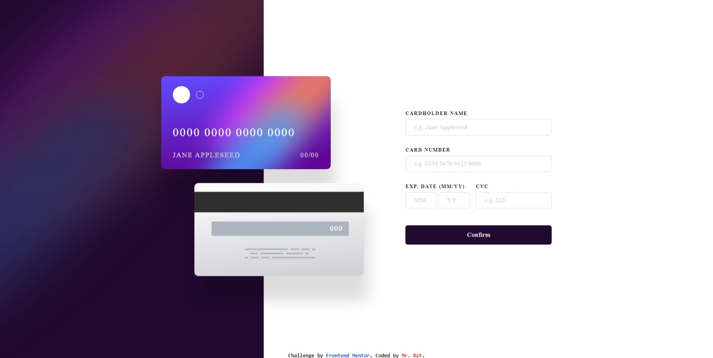

# Frontend Mentor - Interactive card details form solution

This is a solution to the [Interactive card details form challenge on Frontend Mentor](https://www.frontendmentor.io/challenges/interactive-card-details-form-XpS8cKZDWw). Frontend Mentor challenges help you improve your coding skills by building realistic projects. 

## Table of contents

- [Overview](#overview)
  - [The challenge](#the-challenge)
  - [Screenshot](#screenshot)
  - [Links](#links)
- [My process](#my-process)
  - [Built with](#built-with)
  - [What I learned](#what-i-learned)
  - [Continued development](#continued-development)
  - [Useful resources](#useful-resources)
- [Author](#author)
- [Acknowledgments](#acknowledgments)

## Overview

### The challenge

Users should be able to:

- Fill in the form and see the card details update in real-time
- Receive error messages when the form is submitted if:
  - Any input field is empty
  - The card number, expiry date, or CVC fields are in the wrong format
- View the optimal layout depending on their device's screen size
- See hover, active, and focus states for interactive elements on the page

### Screenshot




### Links

- Solution URL: [https://github.com/MrRyt247/responsive-debit-form_fm.git](https://github.com/MrRyt247/responsive-debit-form_fm.git)
- Live Site URL: [https://mrryt247.github.io/responsive-debit-form_fm](https://mrryt247.github.io/responsive-debit-form_fm/)

## My process

### Built with

- Semantic HTML5 markup
- CSS custom properties
- CSS Flexbox
- CSS Grid Stack
- JS Event Handlers

### What I learned

- I learnt how to use grid stack although I did not really the concept behind it.

```css
.stack {
  ...
  display: grid;
  grid-template-rows: auto min-content;
  ...
}

form {
  ...
  row-gap: 1rem;
  grid-area: 2 / 1 / 3 / 2;
}

.alert {
  ...
  row-gap: 15px;
  grid-area: 1 / 1/ 4 / 2;
}

```
- I learnt how to use key events like how to insert 0 when backspace is pressed.

```js
 if (event.key === "Backspace") {
    cardNumber[i].innerText = 0;
  }
```

- I learnt how to refresh a page. I applied it to a reset button.

```js
const reset = () => {
  window.location = window.location.href;
};
```

### Continued development

- Grid stack
- Form validation with VanillaJS

### Useful resources

- [CSS Grid Stack from Stack Overflow](https://stackoverflow.com/questions/57997501/how-do-i-make-css-grid-stack-on-mobile) - This helped me in creating a responsive grid stack.
- [Triggering a button with key events from W3Schools](https://www.w3schools.com/howto/howto_js_trigger_button_enter.asp) - This helped me to applied key actions onto the webpage.

## Author

- Frontend Mentor - [MrRyt](https://www.frontendmentor.io/profile/MrRyt247)

## Acknowledgments

- CSS Tricks
- W3Schools
- Stack Overflow
